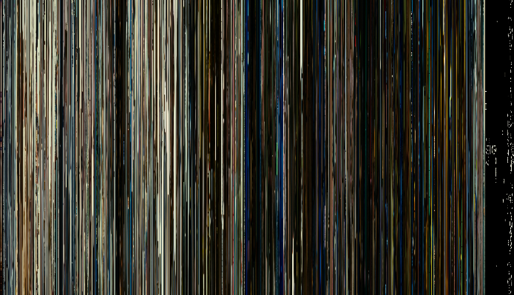
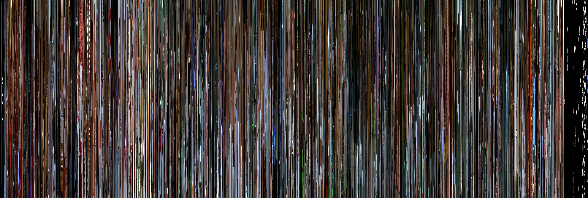
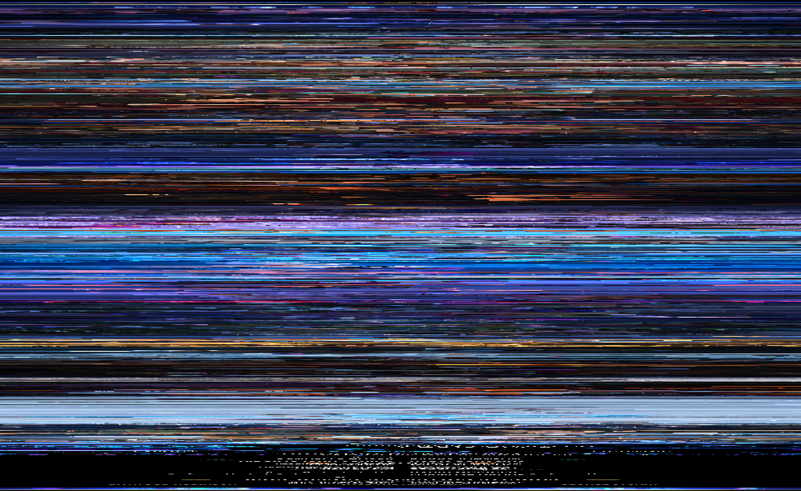
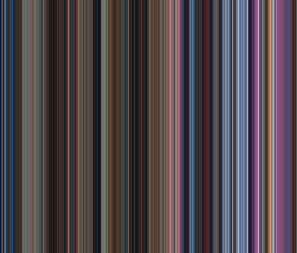
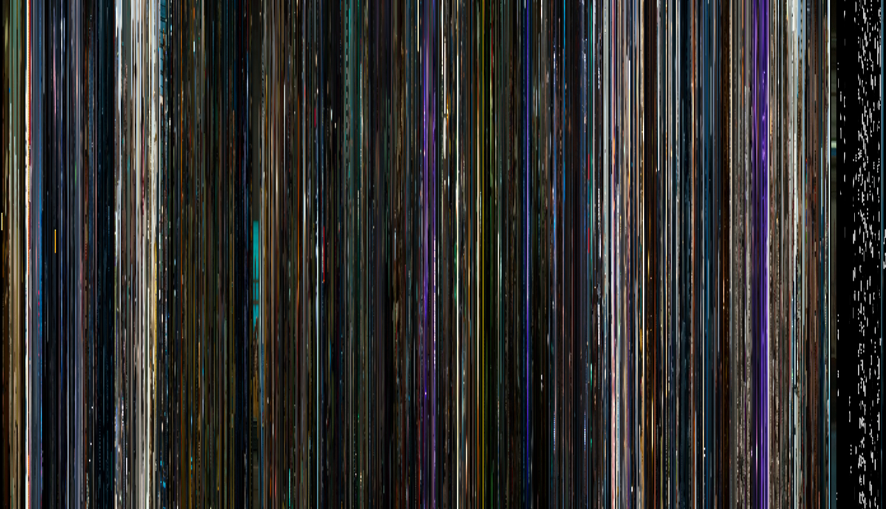
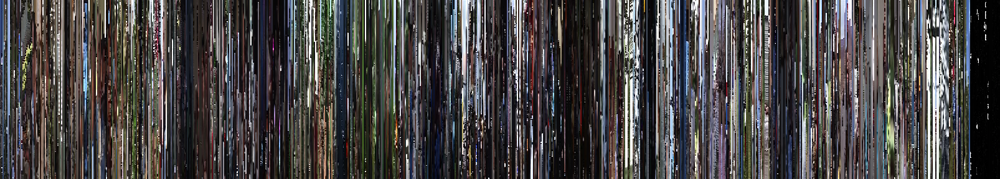
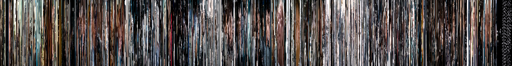
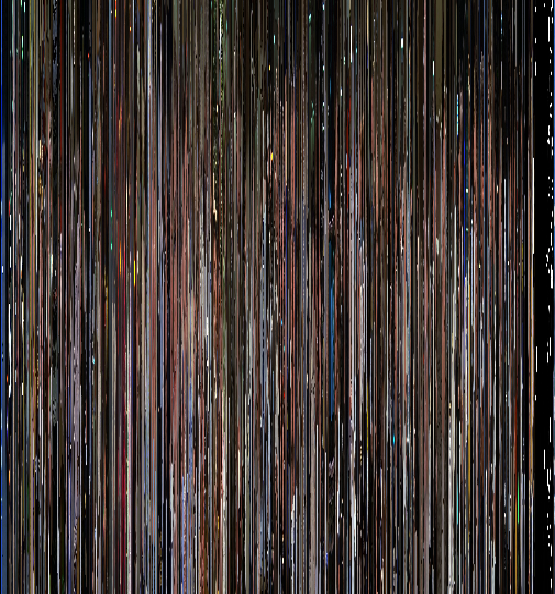
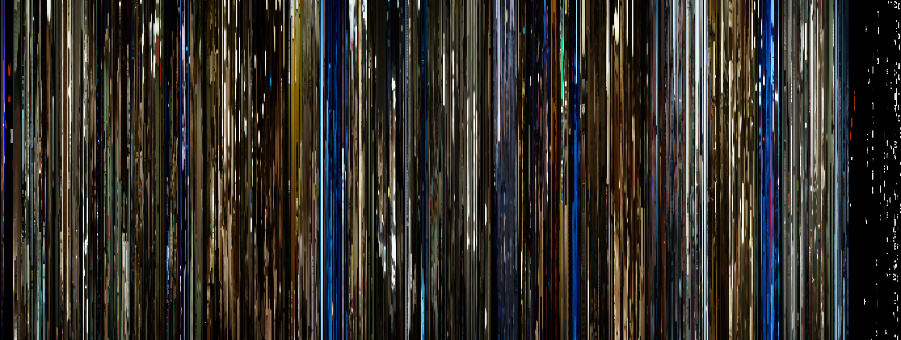
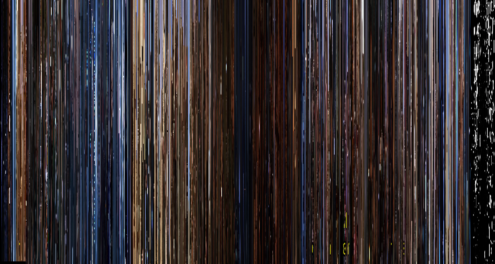

# movie_magic
Captures a small slices or colors from movie frames and combines them to create a beautiful pieces of art.

## See [instructions.md](/instructions.md) to do it yourself.

# Here's an example of "Captain Phillips"

# Apollo 13 (slices)

# Frozen (slices)

# Big Hero 6 (color strips)

# Guardians of the Galaxy (slices)

# Forest Gump (slices)

 
# Interstellar (slices)

# Airplane (slices)

# Birdman (slices)

# Stargate (slices)

