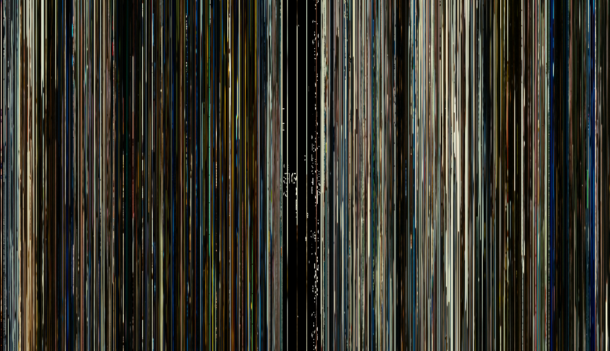

# movie_magic
Captures a small vertical section from the center of movie frames, every certain amount of frames, and combines them horizontally to create a beautiful piece of art.

See [instructions.md](../instructions.md) to do it yourself.

